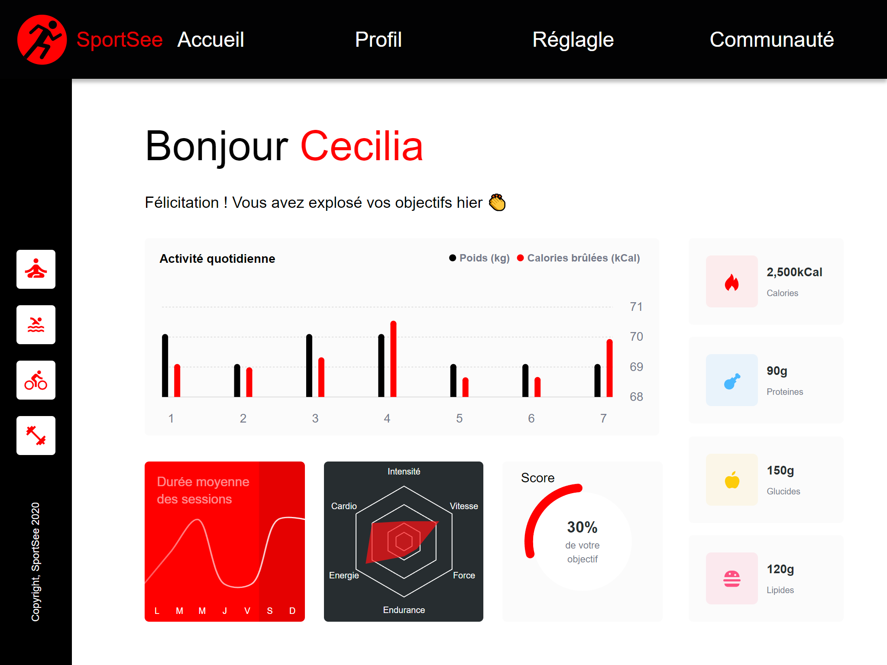

# SportSee

Code du projet 12 SportSee de la formation React d'OpenClassroom en TypeScript avec React, SASS et D3.

## Pré-requis

- Un navigateur internet avec une résolution de 1024px par 768px
- NPM

## Démarrage

- installez les dépendences avec `npm install`
- lancez le server avec `npm run start`
- allez sur la page de [Karl](http://localhost:4000/12) ou de [Cecilia](http://localhost:4000/18)

## Mock

- Pour utiliser les données mockées au lieu de celles du backend, utilisez `useMock()` au lieu de `useApi()` depuis le module des hooks.

## Fabriqué avec

- [Visual Studio Code](https://code.visualstudio.com/) - Environnement de développement
- [NPM](https://www.npmjs.com/) - Package Manager
- [Vite](https://vitejs.dev/) - Bundler
- [React](https://react.dev/) - Framework
- [SASS](https://sass-lang.com/) - Préprocesseur CSS
- [TypeScript](https://www.typescriptlang.org/) - Typage de JavaScript
- [D3](https://d3js.org/) - Librairie pour faire des graphiques

### Auteurs

- **Clément Pivot** _alias_ [@malfeitor](https://github.com/malfeitor)
